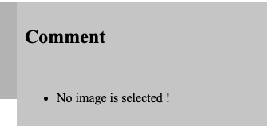

# Beautiful String Photo

#### Brief Intro
This is a flask web app. User can upload a  picture. 
After he click submits, a string photo will be displayed.

#### Exception handling:
- CASE1: If the user doesn't upload image but click submit.

- CASE2: If the user upload an image not in required format.

#### Sample 

